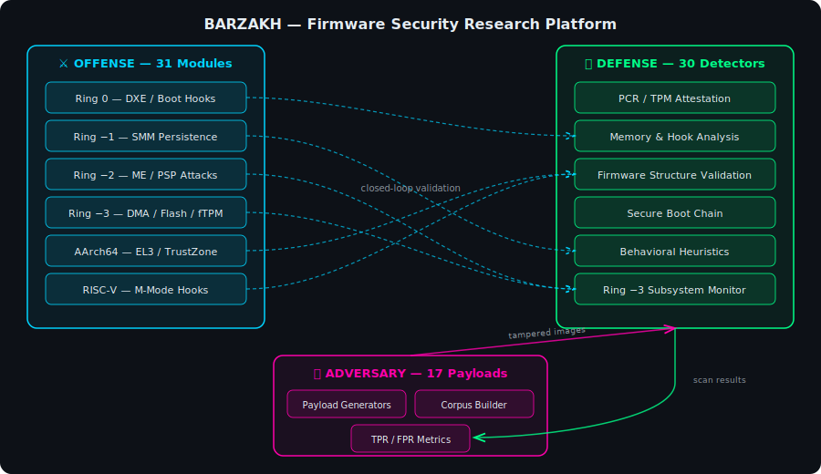

# Project Barzakh (برزخ)

<div align="center">

> *"Barzakh" (برزخ) — a barrier between two realms; the unseen boundary separating the living world from the world of spirits. Here it stands for the barrier between offense and defense, between vulnerability and detection.*

**The most comprehensive open-source UEFI firmware security research platform**

*Offense emulation from Ring 0 to Ring -4 | 75 detection engines | Closed-loop adversary validation*

[](https://github.com/yasindce1998/Barzakh/actions/workflows/barzakh-ci.yml)
[](src/barzakh-scanner-rs/)
[](src/BootkitPkg/)
[](#-license)

</div>

---

> **⚠️ ACADEMIC RESEARCH PROJECT — DEFENSIVE SECURITY ONLY**
>
> This platform exists to study firmware threats and build defenses against them. It contains live offense emulations with hardware-rooted kill-switches. By accessing this repository, you agree to use it solely for legitimate security research and educational purposes.

---

## 📋 What Is Barzakh?

Barzakh is a full-stack firmware security research platform that models real-world bootkit TTPs across every privilege ring — from UEFI DXE drivers (Ring 0) down through SMM, Intel ME, AMD PSP, platform DMA controllers (Ring -3), and CPU microarchitectural threats (Ring -4). It pairs each offense technique with a corresponding detection engine, creating a closed-loop system where every attack is both reproducible and detectable.

**Key capabilities:**
- **31 offense modules** spanning x86_64, AArch64/Apple Silicon, and RISC-V architectures
- **75 specialized detectors** with firmware-specific heuristics and structural analysis (including 9 Android boot chain detectors)
- **64 adversary payload generators** for automated true-positive validation
- **Full Ring -4 coverage** — CPU microcode, speculative execution, thermal/power covert channels, voltage glitching, debug interfaces, rowhammer
- **Hardware lab testing path** — documented progression from simulation to real silicon

### Reference Adversaries Modeled

| Threat | Technique | Barzakh Coverage |
|--------|-----------|-----------------|
| **BlackLotus** (CVE-2023-24932) | Secure Boot bypass via vulnerable shim | `blacklotus` detector + `blacklotus_mok` payload |
| **LogoFAIL** (CVE-2023-40238) | Image parser overflow in UEFI firmware | `logofail` detector + `logofail_image` payload |
| **PixieFail** (CVE-2023-45229+) | Network stack buffer overflows in EDK2 | `pixiefail` detector + `pixiefail_dhcp` payload |
| **CosmicStrand** | SPI flash DXE persistence | FV integrity + SPI region + persistence detector |
| **LoJax** | First in-the-wild SPI implant | ME/SPI detector + flash descriptor analysis |
| **MoonBounce** | Modified core DXE in SPI flash | Boot Services hook + firmware volume diffing |
| **MosaicRegressor** | UEFI persistence framework | Multi-stage: FV tamper + PE inject + trampoline |
| **Hacking Team (RCS)** | UEFI rootkit with Option ROM | Option ROM detector + PCI expansion analysis |
| **FinSpy** | UEFI bootloader modification | ExitBootServices interception + memory scanning |
| **Bootkitty** (2024) | First Linux UEFI bootkit, GRUB signature bypass | `linux_bootchain` detector + `bootkitty_grub_patch` payload |
| **CVE-2024-7344** | Signed reloader loads unsigned PE payloads | `reloader` detector + `secureboot_reloader` payload |
| **CVE-2023-1017/1018** | TPM 2.0 reference implementation buffer overflow | `tpm_command` detector + `tpm_ref_overflow` payload |

---

## 🏗️ Architecture

<div align="center">

</div>

---

## 🧩 Core Components

### 1. BootkitPkg — Offense Emulation (C11, EDK II)

**31 modules** across 4 architectures emulating every known firmware persistence technique:

<details>
<summary><b>x86_64 Core (17 modules)</b></summary>

| Module | Ring | Technique |
|--------|------|-----------|
| `DxeInject` | 0 | DXE phase driver injection with kill-switches |
| `ExitBootHook` | 0 | ExitBootServices interception + MSR hooking |
| `LoadImageHook` | 0 | Boot Services LoadImage/StartImage redirection |
| `SetVariableHook` | 0 | NVRAM variable manipulation |
| `FvPersistence` | 0 | Firmware Volume implant persistence |
| `SpiFlashEmulator` | -1 | SPI controller register emulation |
| `SpiChipsetEmulator` | -1 | Chipset-level SPI interface simulation |
| `SmmPersistence` | -1 | SMM handler installation and SMRAM persistence |
| `CapsuleHijack` | -1 | UEFI capsule update mechanism abuse |
| `AcpiTableInject` | -2 | ACPI table injection for kernel memory access |
| `VirtualAddressMapHook` | -2 | EFI Runtime Services hooking |
| `PciOptionRom` | -2 | PCI Option ROM implantation |
| `MeSpiManipulation` | -3 | Intel ME SPI flash region manipulation |
| `HeciIntercept` | -3 | Host-ME communication channel interception |
| `MeDmaAttack` | -3 | ME-initiated DMA to host memory |
| `AmtSolChannel` | -3 | AMT Serial-over-LAN covert channel |
| `FtpmCommandForge` | -3 | AMD fTPM command forgery via PSP mailbox |

</details>

<details>
<summary><b>AArch64 / Apple Silicon (7 modules)</b></summary>

| Module | Technique |
|--------|-----------|
| `Aarch64DxeInject` | ARM64 DXE injection with EL-aware payloads |
| `ExceptionVectorHook` | VBAR_EL1 exception table relocation |
| `El3SecureMonitor` | EL3 Secure Monitor call interception |
| `TzascManipulation` | TrustZone Address Space Controller bypass |
| `DeviceTreeInject` | Device Tree Blob modification for persistence |
| `IbootTrustChain` | Apple iBoot chain-of-trust subversion |
| `SepMailboxIntercept` | Apple SEP (Secure Enclave) mailbox interception |

</details>

<details>
<summary><b>RISC-V (1 module)</b></summary>

| Module | Technique |
|--------|-----------|
| `RiscVDxeInject` | M-mode firmware injection on RISC-V platforms |

</details>

All offense modules ship with `SIMULATION_MODE = TRUE` — they model behavior without executing real hardware operations. See [`docs/LAB_TESTING.md`](docs/LAB_TESTING.md) for the controlled path to real hardware testing.

---

### 2. Barzakh Scanner — Detection Engine (Rust)

**75 specialized detectors** organized by attack surface:

<details>
<summary><b>Full Detector List</b></summary>

| # | Detector | Category | What It Finds |
|---|----------|----------|---------------|
| 1 | `pcr` | TPM | PCR value anomalies indicating measurement tampering |
| 2 | `pcr_replay` | TPM | PCR replay attack artifacts |
| 3 | `pcr_oracle` | TPM | PCR prediction/oracle patterns |
| 4 | `attestation` | TPM | Remote attestation integrity failures |
| 5 | `hook` | Memory | Boot Services / Runtime Services table hooks |
| 6 | `memory` | Memory | Suspicious memory region patterns |
| 7 | `runtime` | Memory | Runtime service pointer manipulation |
| 8 | `introspection` | Memory | Self-modifying code and anti-analysis |
| 9 | `smm` | Memory | SMRAM boundary and handler anomalies |
| 10 | `firmware_volume` | Structure | FV header/checksum corruption |
| 11 | `spi_integrity` | Structure | SPI flash image structural violations |
| 12 | `differ` | Structure | Binary diffing against known-good baseline |
| 13 | `mbr` | Structure | MBR/VBR modification detection |
| 14 | `entropy` | Structure | Abnormal entropy indicating encrypted payloads |
| 15 | `eventlog` | Structure | TCG Event Log manipulation |
| 16 | `secureboot` | Chain | Secure Boot variable integrity |
| 17 | `self_erasure` | Behavioral | Post-execution cleanup patterns |
| 18 | `timetravel` | Behavioral | Timestamp manipulation artifacts |
| 19 | `symexec` | Behavioral | Symbolic execution of suspicious code paths |
| 20 | `smm_timing` | Ring -3 | SMM handler timing anomalies + TSEG lock status |
| 21 | `s3_bootscript` | Ring -3 | S3 resume boot script DISPATCH abuse |
| 22 | `me_spi` | Ring -3 | Intel ME/SPI flash descriptor manipulation |
| 23 | `acpi_integrity` | Ring -3 | ACPI table checksum + AML injection detection |
| 24 | `heci` | Ring -3 | HECI bus communication anomalies |
| 25 | `amt` | Ring -3 | AMT/SOL provisioning and channel abuse |
| 26 | `ftpm` | Ring -3 | AMD fTPM command/response forgery |
| 27 | `me_dma` | Ring -3 | ME-initiated DMA transaction detection |
| 28 | `spi_region` | Ring -3 | SPI flash region boundary violations |
| 29 | `optionrom` | Ring -3 | Malicious PCI Option ROM injection |
| 30 | `nvram_entropy` | Ring -3 | NVRAM capsule anomaly detection |
| 31 | `logofail` | Boot Process | Malicious BMP/image parser overflow (CVE-2023-40238) |
| 32 | `pixiefail` | Network/PXE | DHCPv6/PXE stack exploits (CVE-2023-45229+) |
| 33 | `blacklotus` | Boot Process | BlackLotus bootkit MOK/BCD manipulation |
| 34 | `amd_psp` | Platform | AMD PSP directory/firmware tampering |
| 35 | `boot_guard` | Platform | Intel Boot Guard ACM/KM/BPM policy bypass |
| 36 | `auth_variable` | Chain | UEFI authenticated variable (PK/KEK/db) rollback |
| 37 | `dxe_dispatcher` | Boot Process | DXE dependency expression hijacking |
| 38 | `pei_implant` | Boot Process | PEI Core/PEIM phase rootkit implants |
| 39 | `capsule_update` | Structure | Firmware capsule update header abuse |
| 40 | `cxl_device` | Hardware/Bus | CXL.mem DMA attacks against system memory |
| 41 | `arm_trustzone` | ARM/TrustZone | OP-TEE TA tampering, SMC call injection, IMG4 bypass |
| 42 | `opensbi` | RISC-V | OpenSBI extension table hooking, mtvec redirect, M-mode escalation |
| 43 | `pmp_bypass` | RISC-V | PMP misconfiguration, CSR write sequences, M-mode RWX regions |
| 44 | `linux_bootchain` | Boot Process | Linux UEFI bootkit detection (Bootkitty GRUB patches) |
| 45 | `reloader` | Boot Process | CVE-2024-7344 signed UEFI app loading unsigned payloads |
| 46 | `sbat` | Chain | SBAT revocation counter rollback detection |
| 47 | `esp_integrity` | Structure | ESP partition rootkit persistence patterns |
| 48 | `confidential_vm` | Platform | Intel TDX / AMD SEV-SNP measurement manipulation |
| 49 | `bmc_spi` | Ring -3 | BMC-to-host lateral movement via SPI flash |
| 50 | `http_boot` | Network/PXE | UEFI HTTP Boot MITM with embedded PE payloads |
| 51 | `tpm_command` | TPM | CVE-2023-1017/1018 TPM 2.0 command buffer overflow |
| 52 | `arm_tbbr` | ARM/TrustZone | ARM Trusted Board Boot Requirements chain bypass |
| 53 | `wifi_dxe` | Hardware/Bus | Intel CNVi wireless DXE firmware injection |
| 54 | `pluton` | Platform | Microsoft Pluton security processor interception |
|  | `secureboot_chain` | Chain | Full Secure Boot chain-of-trust validation |
| 55 | `microcode_injection` | Ring -4 | Malicious/unauthorized CPU microcode update detection |
| 56 | `spectre_gadgets` | Ring -4 | Spectre/Meltdown gadget chains and missing barriers |
| 57 | `thermal_covert` | Ring -4 | Thermal/power covert channel patterns (RAPL MSR abuse) |
| 58 | `voltage_glitch` | Ring -4 | Voltage fault injection (Plundervolt/CLKscrew) setup |
| 59 | `debug_interface` | Ring -4 | Unauthorized debug port enablement (DCI/JTAG/DAP) |
| 60 | `rowhammer` | Ring -4 | Rowhammer exploitation patterns and TRR bypass |
| 61 | `asus_nvram` | Platform | ASUS EZ Flash NVRAM update URL redirect and signature bypass |
| 62 | `idrac_spi` | Ring -3 | Dell iDRAC BMC-to-host SPI flash lateral movement |
| 63 | `insyde_smm` | Ring -2 | Insyde H2O IHISI SMM handler exploitation (CVE-2022-24894) |
| 64 | `lvfs_integrity` | Chain | LVFS/fwupd metadata spoofing and Jcat signature forgery |
| 65 | `arm_tbbr_chain` | ARM/TrustZone | ARM TBBR certificate chain bypass with zeroed hashes |
| 66 | `riscv_pmp_advanced` | RISC-V | Advanced PMP/ePMP bypass with mstatus manipulation |
| 67 | `android_pkvm` | Android | pKVM hypervisor (AVF) — pvmfw signature forgery, EL2 shellcode |
| 68 | `android_dice` | Android | DICE attestation chain — CDI forgery, UDS tampering |
| 69 | `android_gki_boot` | Android | GKI boot.img v4/v5 — AVB hash mismatch, ramdisk tampering |
| 70 | `android_rkp` | Android | Remote Key Provisioning — EEK certificate chain spoofing |
| 71 | `android_binary_transparency` | Android | Pixel Binary Transparency — Merkle inclusion proof forgery |
| 72 | `android_trusty` | Android | Trusty TEE — signature bypass, entry point patching |
| 73 | `android_bootctrl` | Android | Boot Control HAL — A/B slot poisoning, retry exhaustion |
| 74 | `android_vendor_dlkm` | Android | vendor_dlkm — unsigned kernel module injection via EROFS |
| 75 | `android_bootconfig` | Android | Bootconfig parameter injection — init override, SELinux disable |

</details>

**Detection targets:**

| Metric | Target | Method |
|--------|--------|--------|
| True Positive Rate | ≥ 85% | Validated via adversary corpus |
| False Positive Rate | < 5% | Measured against clean firmware baselines |
| ROC-AUC | ≥ 0.92 | Aggregated across all detector categories |
| Scan Latency | < 500ms | Per-image, full 75-detector sweep |

---

### 3. Barzakh Adversary — Red-Team Payload Generator (Rust)

**Standalone binary: `barzakh-adversary`** | **64 payload generators** that produce realistic tampered firmware images for detection validation:

```bash
# Standalone CLI commands (no cargo required — use the release binary)
barzakh-adversary list                          # List all payloads with arch & expected detections
barzakh-adversary generate --arch x86_64        # Generate all x86_64 payloads
barzakh-adversary corpus --output ./corpus      # Generate malicious+clean paired corpus
barzakh-adversary validate --corpus ./corpus    # Run scanner against corpus, measure TPR/FPR
barzakh-adversary qemu --payload trampoline     # Boot payload in QEMU for live testing
barzakh-adversary esp --payload dxe_persistence # Build ESP image for hardware testing
```

| Payload | Target Detector | Technique |
|---------|----------------|-----------|
| `signature_plant` | `hook` | Plants Boot Services hook signatures |
| `fv_tamper` | `firmware_volume` | Corrupts FV headers/checksums |
| `boot_services_hook` | `hook`, `memory` | Injects BS table redirections |
| `pe_inject` | `differ`, `entropy` | Embeds PE payloads in firmware volumes |
| `trampoline` | `runtime`, `self_erasure` | Installs runtime trampolines |
| `me_spi_region` | `me_spi` | Manipulates flash descriptor regions |
| `amt_sol` | `amt` | Injects AMT SOL provisioning artifacts |
| `ftpm_forge` | `ftpm` | Forges fTPM command sequences |
| `me_dma_inject` | `me_dma` | Creates ME DMA transaction patterns |
| `spi_region_tamper` | `spi_region` | Violates SPI region boundaries |
| `smm_timing_anomaly` | `smm_timing` | Plants SMM handler anomalies |
| `optionrom_inject` | `optionrom` | Embeds malicious Option ROMs |
| `acpi_backdoor` | `acpi_integrity` | Injects AML OperationRegions targeting kernel space |
| `heci_traffic` | `heci` | Generates suspicious HECI patterns |
| `nvram_capsule` | `nvram_entropy` | Creates anomalous NVRAM capsule entries |
| `s3_bootscript_inject` | `s3_bootscript` | Injects S3 DISPATCH opcodes |
| `secureboot_bypass` | `secureboot_chain` | Simulates Secure Boot variable tampering |
| `logofail_image` | `logofail` | Crafted BMP with integer overflow triggers |
| `pixiefail_dhcp` | `pixiefail` | Malformed DHCPv6 with buffer overflow options |
| `blacklotus_mok` | `blacklotus` | MOK manipulation + revoked bootloader hashes |
| `psp_tamper` | `amd_psp` | AMD PSP directory corruption + oversized entries |
| `boot_guard_bypass` | `boot_guard` | ACM/KM/BPM with SVN rollback + empty IBB |
| `auth_var_rollback` | `auth_variable` | Authenticated variable monotonic counter rollback |
| `dxe_depex_hijack` | `dxe_dispatcher` | Invalid DEPEX opcodes + stack overflow |
| `pei_core_patch` | `pei_implant` | PEI Core entry point redirection + encrypted RAW |
| `capsule_tamper` | `capsule_update` | Invalid capsule headers + absurd payload counts |
| `cxl_dma_attack` | `cxl_device` | CXL DVSEC with DMA ranges in SMM/runtime memory |
| `arm_trustzone` | `arm_trustzone` | OP-TEE TA header with suspicious load address |
| `arm_iboot` | `arm_trustzone` | Apple IMG4 with null IV KBAG + empty SHSH certificate |
| `arm_scm` | `arm_trustzone` | Qualcomm SCM call injection (SMC #0 with non-standard service IDs) |
| `riscv_opensbi` | `opensbi` | OpenSBI extension table with redirected ecall handlers |
| `riscv_uefi_boot` | `opensbi`, `memory` | RISC-V UEFI boot flow M-mode escalation |
| `riscv_pmp_bypass` | `pmp_bypass` | PMP all-permissive config with full-range address match |
| `bootkitty_grub_patch` | `linux_bootchain` | Linux GRUB signature verification NOP sled |
| `secureboot_reloader` | `reloader` | CVE-2024-7344 signed PE with embedded unsigned payload |
| `sbat_rollback` | `sbat` | SBAT generation counter downgrade attack |
| `esp_persistence` | `esp_integrity` | ESP partition rootkit with multi-path persistence |
| `runtime_services_hook` | `runtime` | Runtime Services covert channel via GetVariable |
| `tdx_ovmf_inject` | `confidential_vm` | Intel TDX OVMF measurement manipulation |
| `bmc_spi_lateral` | `bmc_spi` | BMC IPMI/Redfish SPI flash lateral movement |
| `gpu_vbios_implant` | `optionrom` | GPU Option ROM persistence with DXE stub injection |
| `http_boot_mitm` | `http_boot` | UEFI HTTP Boot response with embedded PE payload |
| `tpm_ref_overflow` | `tpm_command` | CVE-2023-1017/1018 TPM command buffer overflow |
| `arm_tbbr_bypass` | `arm_tbbr` | ARM Trusted Board Boot chain bypass with zeroed hashes |
| `wifi_dxe_inject` | `wifi_dxe` | Intel CNVi wireless DXE firmware injection |
| `pluton_intercept` | `pluton` | Microsoft Pluton mailbox interception + DICE tampering |
| `sev_snp_vmpl_escape` | `confidential_vm` | AMD SEV-SNP VMPL privilege confusion attack |
| `asus_nvram_redirect` | `asus_nvram` | ASUS EZ Flash NVRAM URL redirect + signature bypass |
| `idrac_spi_lateral` | `idrac_spi` | Dell iDRAC BMC-to-host SPI flash write attack |
| `insyde_smm_overflow` | `insyde_smm` | Insyde H2O capsule SMM buffer overflow |
| `lvfs_metadata_spoof` | `lvfs_integrity` | LVFS metadata spoofing + Jcat signature forgery |
| `android_pkvm_escape` | `android_pkvm` | pKVM pvmfw signature forgery + EL2 shellcode |
| `android_dice_forge` | `android_dice` | DICE CBOR certificate chain with predictable CDI |
| `android_gki_tamper` | `android_gki_boot` | GKI boot.img v4 with invalid AVB hash |
| `android_rkp_spoof` | `android_rkp` | RKP provisioning blob with fake EEK chain |
| `android_bt_forge` | `android_binary_transparency` | Fake transparency log + Merkle proof |
| `android_trusty_tamper` | `android_trusty` | Trusty OS image with patched entry + disabled sig |
| `android_bootctrl_poison` | `android_bootctrl` | A/B boot metadata with both slots unbootable |
| `android_dlkm_inject` | `android_vendor_dlkm` | EROFS image with unsigned kernel module |
| `android_bootconfig_inject` | `android_bootconfig` | Bootconfig with init override + SELinux disable |

**Validation loop:** `generate payload` → `scan with detector` → `assert finding raised` → measure TPR/FPR

---

### 4. AttestationPkg — Defensive Telemetry (C11, EDK II)

- TPM 2.0 PCR querying (banks 0, 2, 4, 7)
- TCG Event Log extraction and parsing
- Ground truth data generation for detector training
- Runtime measurement logging

---

## 🔒 Security Safeguards

### Hardware-Rooted Kill-Switches

Every offense module contains multiple independent kill-switches that prevent execution outside authorized environments:

| Kill-Switch | Mechanism | Bypass Difficulty |
|-------------|-----------|-------------------|
| **SMBIOS UUID Binding** | Cryptographic check against whitelisted UUIDs | Requires hardware reprogramming |
| **TPM EK Pinning** | Bound to specific TPM Endorsement Keys | Requires TPM replacement |
| **Time-Bomb** | Hardcoded UTC expiry timestamp | Requires source modification + rebuild |
| **Air-Gap Enforcement** | Network interface detection at DXE phase | Cannot be bypassed without code change |
| **SIMULATION_MODE** | Global flag preventing real hardware operations | Must be explicitly disabled per-module |

### Operational Security

- QEMU + OVMF virtualization as default execution environment
- Append-only GPG-signed audit logs for all test runs
- AES-256 encrypted cold storage for firmware images
- No pre-compiled binaries in repository — all artifacts built from source
- CI/CD enforces `clippy`, `fmt`, and test passage before merge

---

## 🛠️ Technology Stack

| Layer | Technology | Purpose |
|-------|-----------|---------|
| Firmware Framework | EDK II (edk2-stable202405) | UEFI module development |
| Offense Language | C11 (EDK II conventions) | DXE drivers, SMM handlers |
| Detection Engine | Rust (stable) | Scanner, adversary, CLI |
| Virtualization | QEMU 7.0+ / KVM / OVMF | Isolated test environment |
| TPM Emulation | swtpm 0.7+ | Software TPM 2.0 |
| CI/CD | GitHub Actions | Rust tests, clippy, fmt |
| Flash Tools | flashrom, me_cleaner, ifdtool | Hardware lab operations |
| Platform Analysis | chipsec, UEFITool | Security assessment |

---

## 📁 Repository Structure

```
barzakh/
├── docs/
│   ├── ARCHITECTURE.md             # System architecture deep-dive
│   ├── SETUP.md                    # Environment setup guide
│   ├── TESTING.md                  # Virtualization-first testing strategy
│   ├── USECASES.md                 # Offense & defense technique catalog
│   └── LAB_TESTING.md             # Real hardware lab testing guide
├── src/
│   ├── BootkitPkg/                 # Offense emulation (31 C modules)
│   │   ├── DxeInject/              # DXE injection + kill-switches (7 files)
│   │   ├── ExitBootHook/           # ExitBootServices + MSR + memory (4 files)
│   │   ├── SmmPersistence/         # SMM handler persistence
│   │   ├── SpiChipsetEmulator/     # SPI controller emulation
│   │   ├── CapsuleHijack/          # Capsule update abuse
│   │   ├── AcpiTableInject/        # ACPI table injection
│   │   ├── VirtualAddressMapHook/  # Runtime Services hooking
│   │   ├── PciOptionRom/           # Option ROM implantation
│   │   ├── MeSpiManipulation/      # Ring -3: ME/SPI attacks
│   │   ├── HeciIntercept/          # Ring -3: HECI interception
│   │   ├── MeDmaAttack/           # Ring -3: ME DMA attacks
│   │   ├── AmtSolChannel/         # Ring -3: AMT covert channel
│   │   ├── FtpmCommandForge/      # Ring -3: fTPM forgery
│   │   ├── Aarch64/               # ARM64 modules (7 files)
│   │   └── RiscV/                 # RISC-V modules
│   ├── AttestationPkg/             # TPM attestation & telemetry
│   │   ├── TpmAttestation/         # PCR monitoring
│   │   └── EventLogExtractor/      # TCG event log parsing
│   └── barzakh-scanner-rs/         # Rust workspace
│       ├── crates/barzakh-core/    # Detection engine (75 detectors)
│       ├── crates/barzakh-cli/     # CLI binaries (barzakh-scanner + barzakh-adversary)
│       └── crates/barzakh-adversary/ # Red-team library (64 payload generators)
├── scripts/
│   ├── build.sh                    # EDK II compilation
│   ├── qemu-run.sh                 # QEMU test harness with vTPM
│   ├── qemu-e2e.sh                 # End-to-end testing
│   ├── audit-log.sh                # GPG-signed audit logging
│   └── validate-environment.sh     # Pre-flight checks
├── tests/                          # Test suite & corpus samples
├── .github/workflows/              # CI/CD pipeline
├── CONTRIBUTING.md                 # Contribution guidelines
└── SECURITY.md                     # Security policy & disclosure
```

---

## 🚀 Quick Start

### Prerequisites

| Requirement | Minimum | Recommended |
|-------------|---------|-------------|
| OS | Ubuntu 22.04+ (Linux host) | Ubuntu 24.04 |
| RAM | 8 GB | 16 GB |
| Storage | 50 GB | 100 GB SSD |
| CPU | x86_64 with VT-x | Intel Skylake+ (for ME testing) |
| QEMU | 7.0+ with KVM | 8.0+ |
| Rust | stable (latest) | stable + nightly for miri |
| Compiler | GCC 11+ or Clang 14+ | GCC 13 |
| TPM | swtpm 0.7+ | swtpm 0.8+ |

### 1. Environment Setup

```bash
# Clone EDK II (pinned version for reproducibility)
git clone https://github.com/tianocore/edk2.git
cd edk2
git checkout edk2-stable202405
git submodule update --init --recursive

# Build OVMF with TPM support
source edksetup.sh
build -a X64 -t GCC5 -p OvmfPkg/OvmfPkgX64.dsc -D TPM2_ENABLE=TRUE
```

### 2. Build Barzakh

```bash
cd /path/to/barzakh

# Configure environment
export WORKSPACE=/path/to/edk2
export PACKAGES_PATH=$WORKSPACE:$(pwd)/src

# Pre-flight checks
./scripts/validate-environment.sh

# Build offense modules (UEFI DXE drivers)
./scripts/build.sh

# Build detection engine
cd src/barzakh-scanner-rs
cargo build --release
```

### 3. Run in Test Environment

```bash
# Launch QEMU with vTPM, air-gap enforcement, and audit logging
./scripts/qemu-run.sh
```

### 4. Scan Firmware

```bash
# Scan a firmware dump with all 75 detectors
./target/release/barzakh-scanner --target /path/to/firmware.bin --report --format html --output report.html

# Compare against a known-good baseline
./target/release/barzakh-scanner --target firmware.bin --baseline clean_baseline.json --report

# Run specific detector categories
./target/release/barzakh-scanner --target firmware.bin --scan-types spi,smm,acpi,me,hook
```

### 5. Validate Detectors (Red-Team Loop)

```bash
# Run adversary payload generation + detection validation
cargo test -p barzakh-adversary

# Full corpus validation (E2E: generate → scan → measure TPR/FPR)
cargo test -p barzakh-adversary -- --ignored corpus_validation

# Or use the standalone barzakh-adversary CLI
./target/release/barzakh-adversary list                    # List all 64 payloads
./target/release/barzakh-adversary generate --arch x86_64  # Generate payloads
./target/release/barzakh-adversary corpus --output ./corpus # Generate test corpus
./target/release/barzakh-adversary validate --corpus ./corpus # Validate detection rates
```

---

## 🧪 Testing

```bash
cd src/barzakh-scanner-rs

# Unit + integration tests (75 detectors, 64 payloads)
cargo test

# Adversary red-team tests
cargo test -p barzakh-adversary

# Full corpus validation
cargo test -p barzakh-adversary -- --ignored corpus_validation

# Code quality
cargo fmt --check
cargo clippy -- -D warnings

# Dependency audit
cargo audit
```

For real hardware testing beyond QEMU, see [`docs/LAB_TESTING.md`](docs/LAB_TESTING.md) — a 5-phase progression from non-destructive analysis to live offense module deployment with full recovery procedures.

---

## 📝 Documentation

| Document | Purpose |
|----------|---------|
| [`docs/ARCHITECTURE.md`](docs/ARCHITECTURE.md) | System architecture, component interactions, data flow |
| [`docs/ANDROID_BOOT.md`](docs/ANDROID_BOOT.md) | Android boot security — 9 modules covering pKVM, DICE, GKI, RKP, Trusty, and more |
| [`docs/SETUP.md`](docs/SETUP.md) | Complete environment setup (EDK II, QEMU, swtpm, Rust) |
| [`docs/TESTING.md`](docs/TESTING.md) | Virtualization-first testing strategy and CI pipeline |
| [`docs/USECASES.md`](docs/USECASES.md) | Complete catalog of offense/defense techniques with examples |
| [`docs/LAB_TESTING.md`](docs/LAB_TESTING.md) | Real hardware lab guide — equipment, procedures, recovery |
| [`src/barzakh-scanner-rs/README.md`](src/barzakh-scanner-rs/README.md) | Scanner architecture, detector API, extending detectors |
| [`CONTRIBUTING.md`](CONTRIBUTING.md) | Contribution guidelines and code review process |
| [`SECURITY.md`](SECURITY.md) | Security policy and vulnerability disclosure |

---

## 🤝 Contributing

This is a controlled research project. Contributions are limited to:
- Authorized researchers on the project team
- Institutional collaborators with signed agreements
- Peer reviewers during academic publication process

See [`CONTRIBUTING.md`](CONTRIBUTING.md) for detailed guidelines.

---

## 📜 License

Released under a restrictive academic research license. See [`LICENSE`](LICENSE) for full terms.

**Key restrictions:** Academic/educational use only. No commercial use. No weaponization. Must maintain all safety mechanisms. Must comply with institutional oversight.

---

## 🔐 Responsible Disclosure

If you discover a novel vulnerability during research:
1. **Immediate embargo** — do not disclose publicly
2. **Notify PI within 24 hours**
3. **90-day coordinated disclosure** to affected vendors
4. See [`SECURITY.md`](SECURITY.md) for the full procedure

---

## 🎓 Research Contributions

This project models real-world threats including BlackLotus, CosmicStrand, LoJax, MoonBounce, MosaicRegressor, FinSpy, and Hacking Team's UEFI rootkit. Key academic contributions:

- **Full Ring -4 attack taxonomy** — first open-source platform covering ME, PSP, DMA, fTPM, AMT, and CPU microarchitectural (Spectre, Rowhammer, Plundervolt) attack surfaces with corresponding detection
- **Closed-loop validation framework** — every detector has a matching adversary payload; TPR is measured, not estimated
- **PCR replay algorithm** for TPM attestation validation against boot sequence manipulation
- **Firmware Volume structural analysis** reducing false positives through context-aware detection
- **Cross-architecture coverage** — x86_64, AArch64 (including Apple Silicon), RISC-V, and Android boot chain offense modeling
- **Automated CI/CD pipeline** ensuring detection regressions are caught before merge

---

## 📞 Contact

**Principal Investigator:** Yasin  
**Email:** yasindce1998@gmail.com

---

## ⚠️ Disclaimer

This software is provided for academic research purposes only. The authors and affiliated institutions make no warranties regarding fitness for any purpose, accept no liability for misuse, and require strict adherence to institutional oversight and legal frameworks. Unauthorized use may violate applicable laws.

**USE AT YOUR OWN RISK.**
