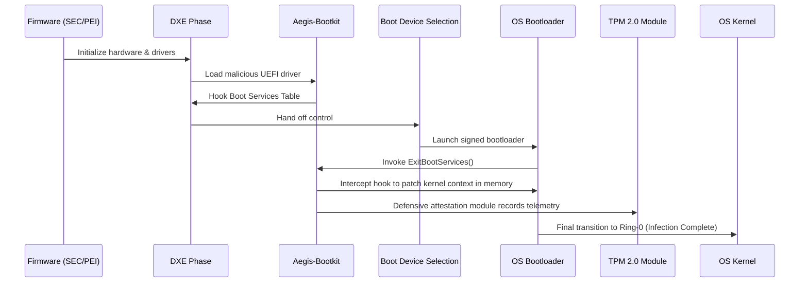
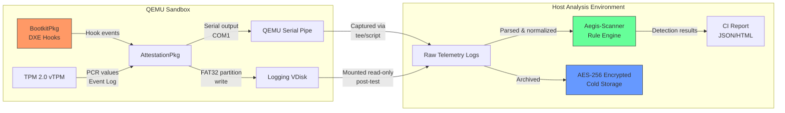

# Aegis-Boot: Technical Architecture & Implementation Details

This document outlines the in-depth technical specifications, system architecture, and low-level methodologies for Project Aegis-Boot. 

## 1. System Architecture

The following sequence diagram illustrates the complete execution flow of the Aegis-Boot environment from platform initialization to OS kernel transition.



## 2. Core Components Stack

| Component | Technology | Specification / Application |
| :--- | :--- | :--- |
| **Development Kit** | EDK II | Industry standard for UEFI firmware driver development. |
| **Languages** | C11, NASM | Low-level hardware manipulation and Ring-0 context switching. |
| **Hypervisor** | QEMU + KVM | Hardware virtualization platform for running test environments. |
| **Firmware Payload** | OVMF | Specific Open Virtual Machine Firmware builds for deterministic reproducibility. |
| **Security Module** | TPM 2.0 | Hardware root of trust for PCR queries and event log measurements. |

## 3. Emulation Module: UEFI Hooking Mechanisms

### 3.1 DXE Phase Implantation
The bootkit payload is packaged as a standard UEFI DXE driver. It is introduced into the system either via simulated capsule updates or direct SPI flash modifications (strictly inside the hypervisor). 
* **Target:** Hooking the `EFI_BOOT_SERVICES` table.
* **Mechanism:** The driver locates the global `gBS` pointer and replaces function pointers such as `AllocatePool` and `CreateEvent` to track memory allocation of the legitimate OS bootloader (e.g., `bootmgfw.efi` or `GRUB`).

### 3.2 ExitBootServices Interception
To survive the transition from the UEFI environment to the OS kernel, the bootkit must intercept the hand-off.
* **Target:** `gBS->ExitBootServices`
* **Mechanism:** 
  1. The malware hooks `ExitBootServices`.
  2. When the OS bootloader calls this function to take control of memory mapping, the hook is triggered.
  3. The bootkit payload secures its own memory by marking it as `EfiRuntimeServicesCode` or `EfiRuntimeServicesData`, which the OS is legally bound to preserve.
  4. The hook attempts to patch the loaded OS kernel image in memory before returning execution to the original `ExitBootServices`.

### 3.3 Model Specific Register (MSR) Hooking
To emulate advanced stealth characteristics (e.g., hiding from EDRs running in Ring-0):
* **Target:** `IA32_LSTAR` or `IA32_SYSENTER_EIP` MSRs.
* **Mechanism:** The bootkit alters the system call handler routines, intercepting OS-level API calls before they reach the kernel, ensuring deep system introspection capabilities.

> **⚠️ Scope Justification:** MSR hooking extends beyond traditional bootkit persistence into rootkit-adjacent territory. This technique is included because real-world adversaries (e.g., CosmicStrand) employ it as a post-boot stealth mechanism, and the Aegis-Scanner must be validated against it. This module is **read-only instrumentation** — it intercepts and logs system calls but does **not** modify kernel data structures, exfiltrate data, or establish persistence beyond the current boot session. This distinction keeps the implementation within the PRD's Non-Goals boundary (§3.3). If IRB review determines this exceeds acceptable scope, the module can be disabled via the `AEGIS_DISABLE_MSR_HOOK` build flag without affecting the core DXE/ExitBootServices emulation.

## 4. Defensive Attestation Module

This module ensures that the research acts as a "blue-team" tool, effectively logging and verifying the impact of the aforementioned hooks.

### 4.1 PCR Querying
* Utilizes the `EFI_TCG2_PROTOCOL`.
* Reads critical Platform Configuration Registers (PCRs), specifically PCR 0 (Core System Firmware), PCR 2 (Option ROMs), and PCR 4 (Boot Manager Code).
* Compares expected hash values (whitelisted boot process) against the compromised values to quantify detection efficacy.

### 4.2 TCG Event Log Parsing
* Extracts the TCG Event Log from firmware memory.
* Analyzes `EV_EFI_BOOT_SERVICES_APPLICATION` and `EV_EFI_BOOT_SERVICES_DRIVER` entries.
* Provides the ground truth data for the `Aegis-Scanner` rule generation.

### 4.3 Telemetry & Attestation Data Flow

The following diagram illustrates how defensive telemetry flows from the UEFI environment through to the analysis pipeline, ensuring data integrity at each stage.



**Key invariants:**
* Telemetry never traverses a network — all data transfer is via serial pipe or mounted virtual disk.
* Raw logs are hashed (SHA-256) immediately upon extraction; hashes are recorded in the CI report for tamper detection.
* Cold storage archives are retained per the PRD data retention policy (§8, max 36 months).

## 5. Security Constraints & Failsafes

### 5.1 Hardware-Rooted Binding 
To prevent the payload from running on any ad-hoc machine, the driver performs an early execution check:
1. **SMBIOS Check:** Queries the SMBIOS table for the unique System UUID.
2. **TPM EK Check:** Queries the TPM Endorsement Key public certificate.
3. If the identifiers do not cryptographically match the hardcoded values of the authorized lab equipment, the driver will issue an `EFI_ABORTED` status code and voluntarily unload itself.

### 5.2 Flash Recovery 
A fail-safe to prevent test hardware bricking:
* Employs QEMU `-pflash` snapshots allowing instantaneous rollback of the OVMF firmware state.

### 5.3 Build Chain Integrity & Reproducibility
To prevent supply-chain tampering and ensure academic reproducibility:
* **OVMF Version Pinning:** All builds must use a specific, pinned OVMF commit hash (e.g., `edk2-stable202405`, commit `a]b1c2d3e4f5`). The exact commit is recorded in `scripts/build.sh` and must match the value documented in the test environment setup.
* **Reproducible Builds:** `build.sh` uses deterministic compiler flags (`-frandom-seed`, fixed `SOURCE_DATE_EPOCH`) to ensure byte-identical outputs across machines.
* **Artifact Signing:** All compiled `.efi` binaries are signed with a project-specific Ed25519 key (stored in an HSM or hardware token, never committed to the repository). Signatures are verified before any QEMU test execution.
* **SBOM Generation:** Each build produces a Software Bill of Materials (SPDX format) cataloging all EDK II dependencies, compiler versions, and OVMF source hashes.
* **Commit Signing:** All repository commits must be GPG-signed. Unsigned commits are rejected by branch protection rules.

## 6. Repository Layout

```text
aegis-boot/
├── docs/
│   ├── SETUP.md              # Environment setup guide
│   ├── ARCHITECTURE.md       # This file
│   └── TESTING.md            # Testing strategy
├── src/
│   ├── BootkitPkg/           # EDK II package: UEFI bootkit emulation
│   │   ├── DxeInject/        # DXE phase implantation + kill-switches
│   │   └── ExitBootHook/     # ExitBootServices interception & MSR hooking
│   ├── AttestationPkg/       # Defensive TPM querying & event log extractors
│   └── AegisScanner/         # Detection engine (Python)
├── scripts/
│   ├── build.sh              # EDK II compilation
│   ├── qemu-run.sh           # QEMU test harness with vTPM
│   ├── nvram-recovery.py     # NVRAM backup/restore
│   ├── validate-environment.sh # Pre-flight checks
│   └── audit-log.sh          # Append-only execution audit logger
├── tests/                    # Unit, integration, and corpus tests
├── .github/workflows/        # CI/CD pipeline
├── CONTRIBUTING.md
├── SECURITY.md
└── README.md
```